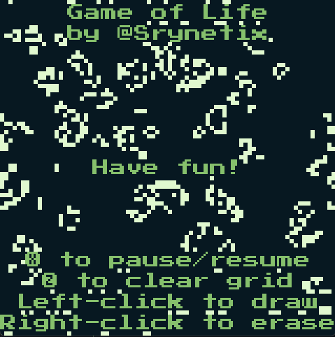

# Game of Life for WASM-4

A game written in Rust for the [WASM-4] fantasy console.

<p align="center">
    
</p>

## Features

- No memory allocation (and no-std)
- Configurable grid size using const values (just change the `CELL_SIZE` value in the [crates/wasm4-gol/src/logic.rs](./crates/wasm4-gol/src/logic.rs) file)
- Uses a simple ad-hoc WASM-4 wrapper called [wasm4-sx]

## Dependencies

- The [WASM-4] CLI (`w4`)
- A stable [Rust] compiler with the `wasm32-unknown-unknown` target
- The [Just] command runner

For release builds:
- The `wasm-opt` tool from the [binaryen] project
- The `wasm-strip` tool from the [wabt] project

For WASM analysis (`analyze` tasks):
- Optionally, for WASM analysis, the [twiggy] tool

## Building and running

You can type `just` to see the different build and export tasks.  
Here are some examples:

```sh
# Build the cartridge in release mode + strip and run WASM-4 on web
just run-release-web

# Build the cartridge in release mode + strip and run WASM-4 on native mode
just run-release-native

# Build the cartridge in release mode + strip and export to HTML file
just export-release-web

# Build the cartridge in release mode + strip and export to Windows EXE file
just export-release-exe
```

[WASM-4]: https://wasm4.org
[Rust]: https://www.rust-lang.org/
[binaryen]: https://github.com/WebAssembly/binaryen
[wabt]: https://github.com/WebAssembly/wabt
[Just]: https://github.com/casey/just
[twiggy]: https://github.com/rustwasm/twiggy
[wasm4-sx]: ./crates/wasm4-sx/README.md
